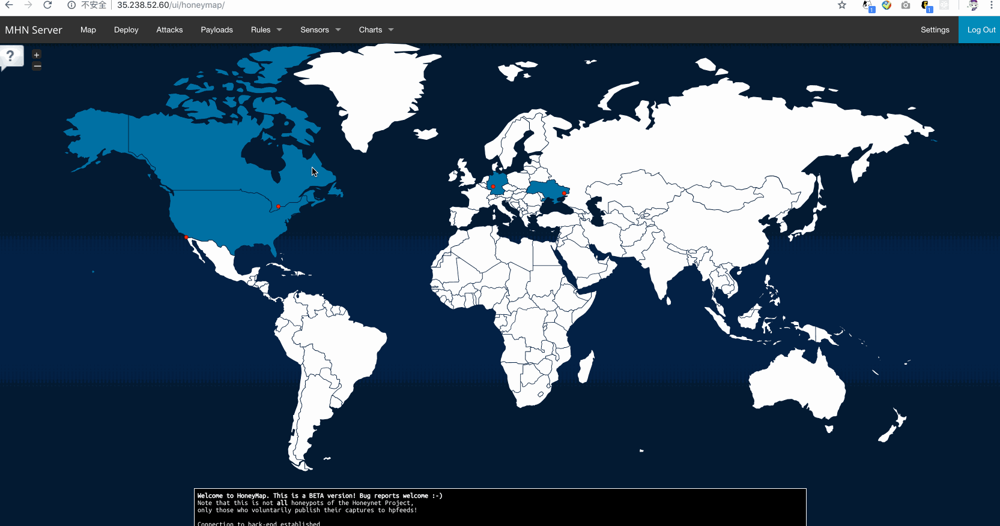
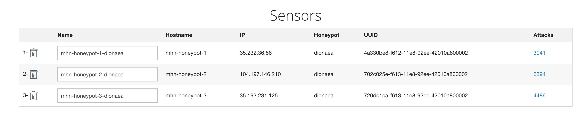

# Week9 Web Security

## GIF Walkthrough:

## Any Issue Encoutered
Configuration of mhn and vm instances actually took a lot of time but overall all the issues had been resolved.

## Summary of data collected

  ### TOP 5 Attacker IPs:
  -  173.77.241.134 (2,972 attacks)
  -  58.82.250.151 (304 attacks)
  -  104.248.29.221 (304 attacks)
  -  5.62.63.222 (272 attacks)
  -  104.248.19.20 (251 attacks)
  
  ### TOP 5 Attacked ports:
  - 8088 (3,174 times)
  - 445 (796 times)
  - 23 (724 times)
  - 3306 (721 times)
  - 80 (712 times)

## Deployed Honeypots.

### session.json contains all attack reports.

## Time Spent
10hours approx.
